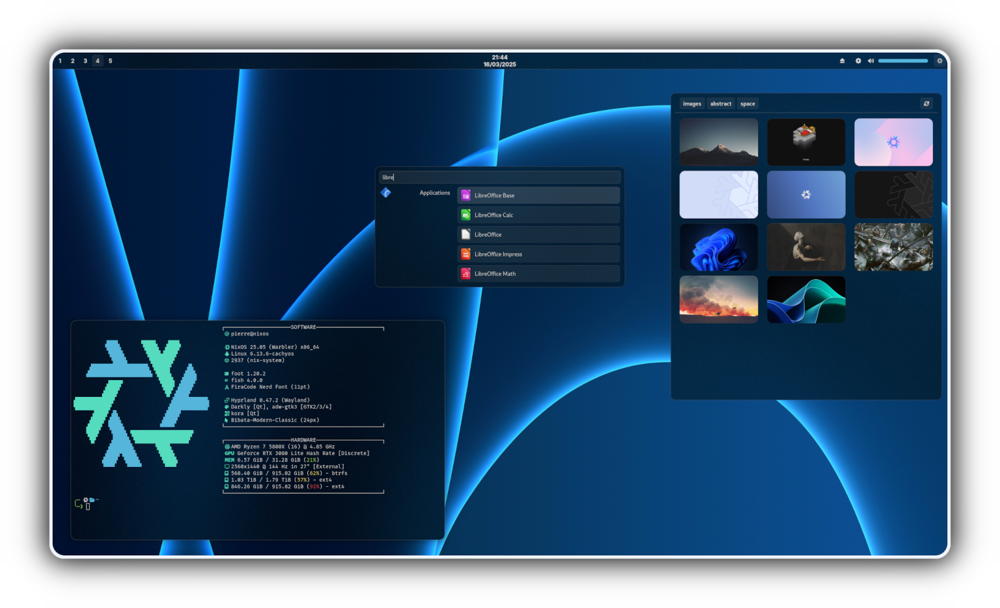

<div align="center">
▄▀█ ▀▀▄ █░█ █▀█ ▀█▀ █▀▄ █▀▀<br>
█▀█ ▄█▄ █▄█ █▀▄ ▄█▄ █▄▀ ██▄
</div>

---

<div align="center">
<a href=".github/assets/showcase-hd"></a>

<a href="#instalation"><kbd> <br> Installation <br> </kbd></a>&ensp;
<a href="#configuration"><kbd> <br> Configuration <br> </kbd></a>&ensp;
<!-- <a href="#"><kbd> <br>  <br> </kbd></a> -->
</div>

> [!WARNING]
> This is highly work-in-progress

# Instalation
## NixOS
1. Add to your flake's inputs
   ```Nix
   # flake.nix
   inputs = {
     # ...
     home-manager = { # This is mendatory
       url = "github:nix-community/home-manager";
       inputs.nixpkgs.follows = "nixpkgs";
     };
     azuride.url = "github:PierreBorine/azuride";
   };
   ```

2. Import and enable the `nixosModule`
   ```Nix
   # nixos
   {inputs, ...}: {
     imports = [inputs.azuride.nixosModules.default];
     azuride.enable = true;
   }
   ```

## Non-NixOS
Non supported (yet ?) and untested, but probably possible and not very hard.


## Additional Notes
> [!TIP]
> If you have an [impermanent](https://github.com/nix-community/impermanence)
> setup, you can easily access lists of elements to persist with the following
>two options:
> ```Nix
> config.azuride.persist.dirs
> config.azuride.persist.files
> ```

> [!IMPORTANT]
> - Requiers `pkgs.foot` to be installed

> [!WARNING]
> Once again, this is highly work-in-progress, this may not work correctly
> on your machine, I advice you to not use this flake in your own config
> for now.

# Configuration
TODO
